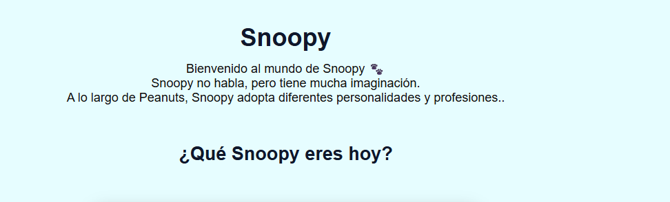
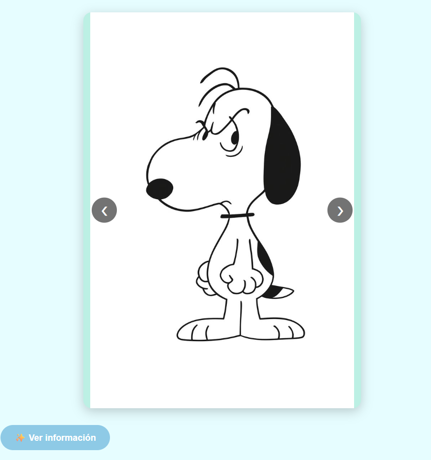
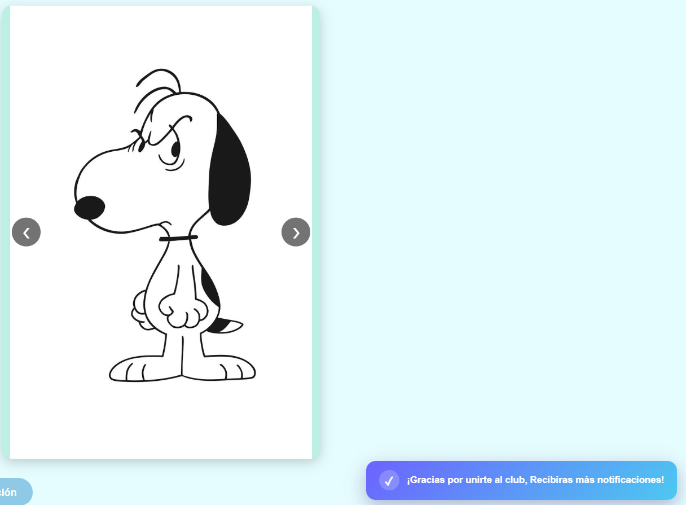

# 🐾 Componentes JS - Snoopy

Proyecto de JavaScript que contiene componentes visuales interactivos y reutilizables.

## 🎠 Componentes

- **Carrusel:** permite navegar entre diferentes imágenes.
- **Modal:** muestra información de Snoopy al presionar un botón.
- **Toast:** muestra una notificación después de aceptar el modal.

## 🛠️ Tecnologías

- HTML5
- CSS3
- JavaScript

No se utilizaron frameworks.

## 📁 Estructura

```text
Actividad3/
├── index.html
├── README.md
├── css/
│   └── estilo.css
├── js/
│   └── componennte.js
└── img/

## ✨ Características

* Componentes reutilizables.
* Animaciones.
* Diseño interactivo.
* Generación dinámica mediante JavaScript.

## Capturas








## 👩‍💻 Autora

**Karla Martinez Bautista**

Proyecto académico de Programacion Web.

